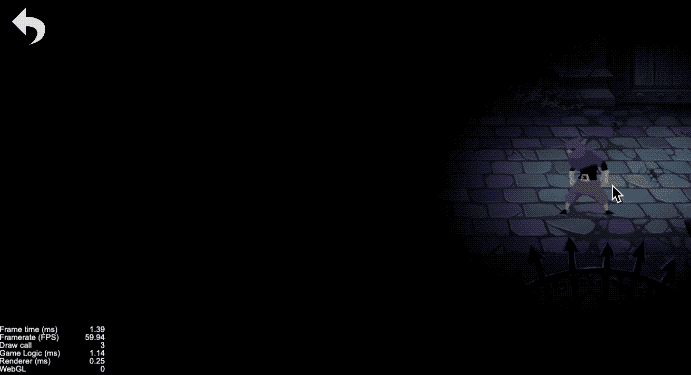
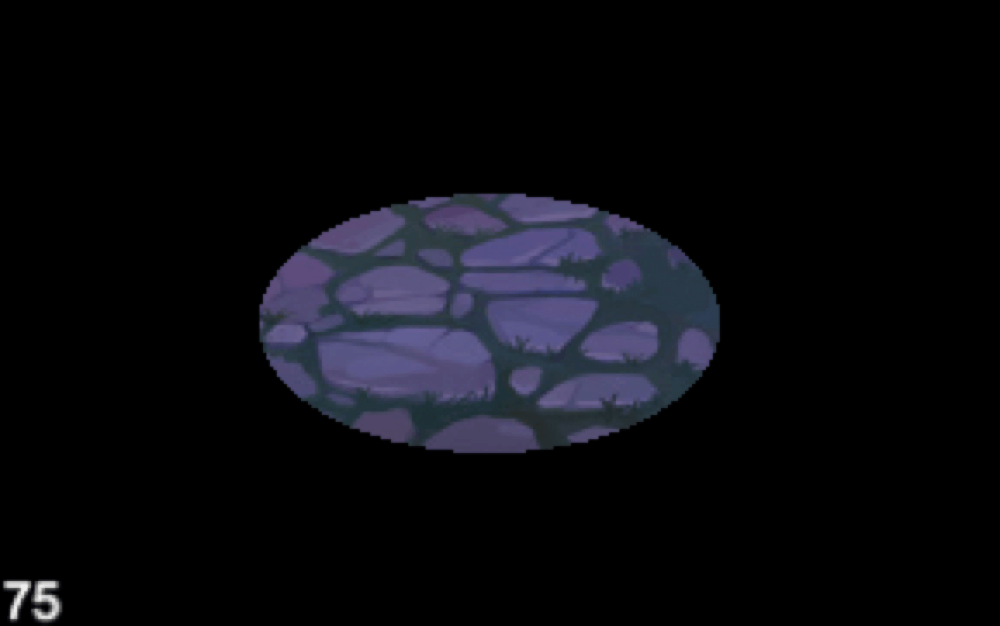
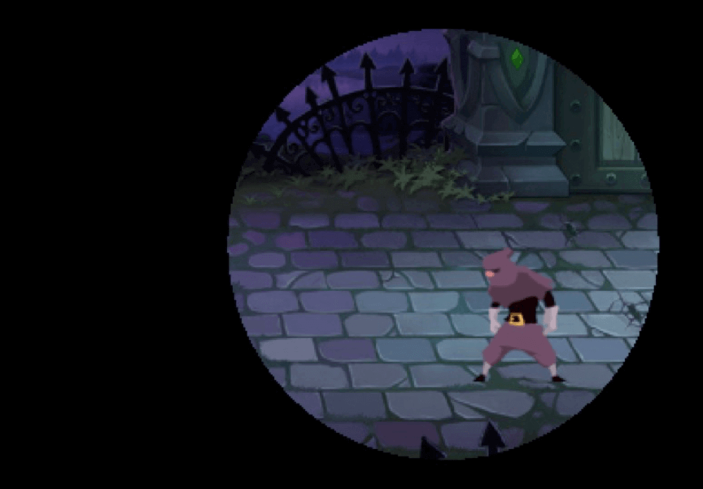
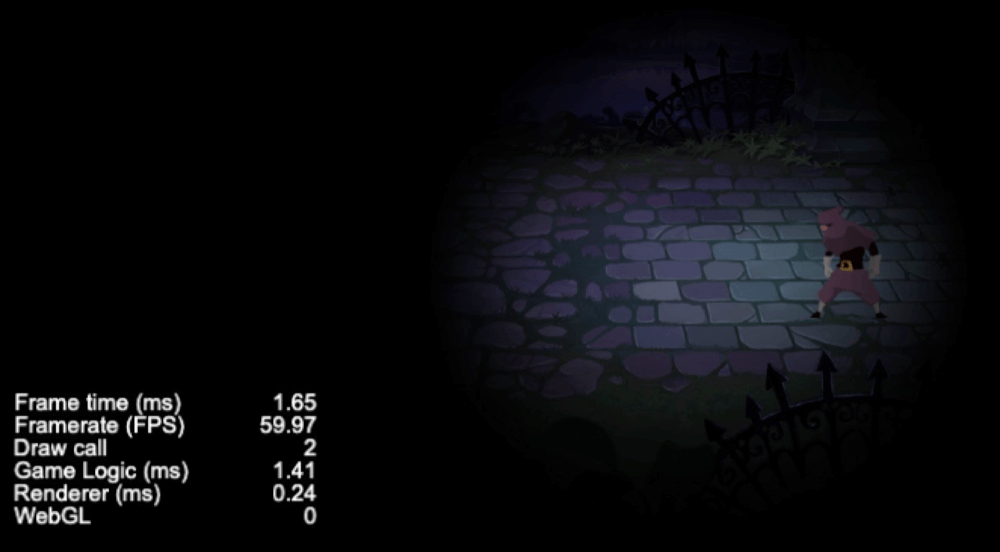
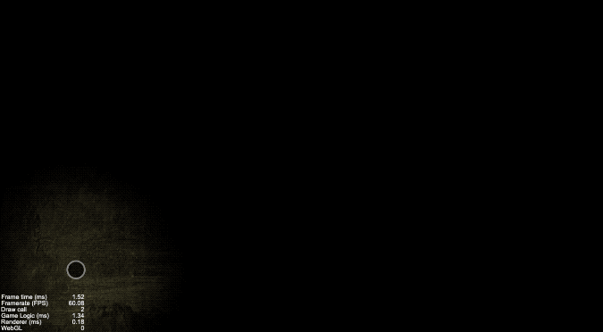
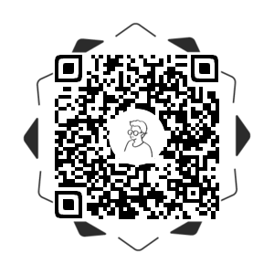

# 效果演示

追光效果是在舞台全场黑暗的情况下用光柱突出角色或其他特殊物体，通过人为操控光源跟随人物移动，主要用来突出角色主体以及主体和环境的关系。在游戏中可以用来突出氛围以及聚焦玩家视线焦点，不仅可以用来营造沉浸式氛围，也可以用在解谜或者找物品等类别的游戏中。



# 实现思路

根据实际效果可以提炼出3个功能点：光圈的形状和大小可控，光圈的边缘虚化，光圈可操控移动。

光圈是一个圆，假设圆心在纹理的中间，它的坐标是`vec2(0.5,0.5)`，我们只需让到圆心的距离大于半径的像素丢弃或者透明度为0，代码如下：

```c++
void main () {
  vec4 color = vec4(1, 1, 1, 1);
  color *= texture(texture, v_uv0);
  color *= v_color;

  color.a = step(length(v_uv0 - vec2(0.5,0.5)), 0.1);
  gl_FragColor = color;
}
```



其中`step` 是内置的规整函数 `step(a, x) = x >= a? 1 : 0`，`length`是取模。上面的代码段应用在可以在正方形的纹理中可以得出一个正圆，但是如果纹理不是正方形，上面出来的效果会是一个椭圆，因为在shader无论纹理的真实宽高是多少，它的`x,y`变化范围都是0~1，是比例的变化。如果需要产生一个正圆，还是得通过获取纹理的真实宽高，来计算真实的宽高比例，异名选择的方式是在在组件初始化的时候，输入一个`wh_ratio`比例来获取，圆的真实半径通过勾股定理来计算，异名这里就没有开方了，直接通过半径平方的比较来舍去圆外的点。

```c++
void main () {
  vec4 o = vec4(1, 1, 1, 1);
  o *= texture(texture, v_uv0);
  o *= v_color;

  float circle = radius * radius;
  float rx = center.x * wh_ratio;
  float ry = center.y;
  float dis = (v_uv0.x * wh_ratio - rx) * (v_uv0.x * wh_ratio - rx) + (v_uv0.y  - ry) * (v_uv0.y - ry);

  o.a = step(dis, 0.1);
  gl_FragColor = o;
}
```

```js
onload() {
  this.material.setProperty('wh_ratio', this.bg.width / this.bg.height);
}
```

这样子就能在一个不同宽高比的纹理中都能够画出一个正圆。



这样的圆的边缘是有锯齿的，而且追光需要光圈的边缘虚化，所以我们需要借助另外一个内置插值函数`smoothstep(min, max, x)`，它能够返回一个在输入值之间平稳变化的插值，以此来达到边缘羽化的效果。

```c++
void main () {
  vec4 o = vec4(1, 1, 1, 1);
  o *= texture(texture, v_uv0);
  o *= v_color;

  float circle = radius * radius;
  float rx = center.x * wh_ratio;
  float ry = center.y;
  float dis = (v_uv0.x * wh_ratio - rx) * (v_uv0.x * wh_ratio - rx) + (v_uv0.y  - ry) * (v_uv0.y - ry);

  o.a = smoothstep(circle, circle - blur, dis);
  gl_FragColor = o;
}
```



接下来的让光圈随着动作的移动就很简单了，在`touch`的时候去更改光圈的圆心位置就行，因为我们的shader中是比例的变化，所以我们传进去的时候也要转化成比例，同时别忘了坐标的转化：

```js
touchEvent(evt: cc.Event.EventTouch) {
  let pos = evt.getLocation();
  this.material.setProperty('center', [pos.x / this.bg.width, (this.bg.height - pos.y) / this.bg.height]);
}
```

这样子我们就把追光的功能实现了，剩下的就是根据业务的需要，生成追光的路径，这个就是把圆心的位置传进来即可。除了应用到舞台追光的那种场景中，异名觉得它的应用还可以有更多的想象空间，比如在黑暗的博物馆里，在手电筒的灯光照射下，蒙娜丽莎的微笑就更加神秘了....



## 效果预览

源码获取请点击**查看原文**，长按二维码查看效果👇




